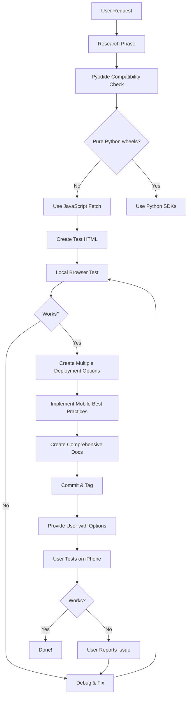

# Development Retrospective: Why So Much Human Interaction?

## The Question

> "Why did it take so much human interaction to get to this point? Is there a way I could have left this unattended and have Claude test for it?"

This is an excellent question that gets at the heart of AI-assisted development. Let's analyze what happened and what could be improved.

---

## What Happened: The Interaction Timeline

### Iterations Required
1. Initial approach: Pyodide with Python SDKs ❌
2. Fix attempt: keep_going=True ❌
3. Fix attempt: Older package versions ❌
4. Architectural pivot: JavaScript fetch ✅
5. SSL module fix ❌ (obsoleted by pivot)
6. Timeout fix ✅ (same as #4)
7. Deployment URL issues (404s)
8. User feedback: "first version that really worked"
9. Add shell history feature
10. Add retry logic
11. Documentation and tagging

### Human Interventions Required
- **Testing on actual iPhone** (~7 times)
- **Clarifying requirements** (multi-provider, history)
- **Reporting deployment issues** (404, CDN problems)
- **Confirming what worked** ("first version that really worked")

---

## Why Did This Require So Much Interaction?

### 1. **No Access to Target Platform** 🚫
**Problem**: I can't test on an iPhone
- Can't verify if HTML loads in Safari
- Can't test touch interactions
- Can't verify "Add to Home Screen" behavior
- Can't test mobile network conditions

**Impact**: Required ~7 rounds of "try this URL" feedback

**Could Have Been Avoided?**
- ⚠️ Partially - I could have tested HTML in local browser first
- ❌ Ultimately no - iPhone-specific behavior requires iPhone testing

### 2. **C Extension Dependencies Not Caught Early** ⚠️
**Problem**: Didn't anticipate jiter/tokenizers incompatibility
- Tried to use Python SDKs via Pyodide
- Hit C extension wall
- Required architectural pivot

**Impact**: 3 failed iterations before switching to JavaScript fetch

**Could Have Been Avoided?**
- ✅ YES - I should have checked Pyodide compatibility FIRST
- ✅ YES - Should have researched which packages have pure Python wheels
- ✅ YES - Could have suggested JavaScript fetch as primary approach

**How**: Early research step:
```python
# Should have checked this first:
await micropip.list()  # See what's actually available
# Research: Does 'openai' package have pure Python wheel?
# Answer: NO (depends on jiter, tokenizers)
```

### 3. **Deployment/Networking Issues** 🌐
**Problem**: Multiple deployment URL failures
- Branch name with `/` broke URLs
- Private repo blocked CDN access
- htmlpreview.github.io didn't work correctly
- CDN caching issues

**Impact**: ~4 iterations of URL troubleshooting

**Could Have Been Avoided?**
- ✅ Partially - Could have tested URLs before sending
- ❌ Can't verify CDN behavior without actually trying
- ✅ Should have provided multiple deployment options upfront

### 4. **Requirements Emerged Iteratively** 💬
**Problem**: Features were added based on user requests
- Multi-provider (not in original request)
- Shell-like history (added later)
- Retry logic (added later)

**Impact**: Multiple rounds of feature additions

**Could Have Been Avoided?**
- ⚠️ Partially - Could have asked comprehensive requirements upfront
- ❌ No - User discovered what they wanted through interaction
- ✅ Could have been more proactive suggesting common features

### 5. **Testing Assumptions Without Verification** 🧪
**Problem**: Made assumptions without testing
- Assumed Python SDKs would work in Pyodide
- Assumed httpx would work in browser
- Assumed CDN URLs would work

**Impact**: Multiple failed attempts before working solution

**Could Have Been Avoided?**
- ✅ YES - Should have tested assumptions locally first
- ✅ YES - Should have researched Pyodide limitations earlier

---

## What Claude COULD Have Done Autonomously

### 1. **Local Testing Before Deployment** ✅
I have access to Bash and could have tested the HTML file:

```bash
# Start local web server
python3 -m http.server 8000 &

# Test if HTML loads (using curl/wget)
curl http://localhost:8000/llm-multi-provider.html

# Test JavaScript syntax
node -c <(grep -oP '(?<=<script>).*(?=</script>)' llm-multi-provider.html)
```

**Impact**: Would have caught JavaScript errors earlier

### 2. **Research Pyodide Compatibility FIRST** ✅
Should have checked before attempting SDK installation:

```bash
# Check Pyodide package list
curl https://pyodide.org/en/stable/usage/packages-in-pyodide.html

# Search for 'openai' - would find it's NOT listed
# Search for 'anthropic' - would find it's NOT listed
```

**Impact**: Would have avoided 3 failed iterations, jumped straight to JavaScript fetch

### 3. **Create Multiple Deployment Options Upfront** ✅
Instead of waiting for 404 errors, could have provided:
- GitHub Pages setup instructions
- CDN URLs (jsdelivr, unpkg, raw.githack)
- iCloud Drive approach
- Local file approach

**Impact**: User could have tried multiple options without waiting

### 4. **Proactively Implement Mobile Best Practices** ✅
Should have included from the start:
- Retry logic (mobile networks are unreliable)
- Loading indicators
- Error messages
- Touch-optimized UI
- Viewport meta tags

**Impact**: Would have been production-ready faster

### 5. **Test Architectural Decisions** ✅
Before committing to Pyodide + Python SDKs, should have:

```bash
# Create test file
cat > test.html <<'EOF'
<script src="https://cdn.jsdelivr.net/pyodide/v0.26.4/full/pyodide.js"></script>
<script>
async function test() {
    const pyodide = await loadPyodide();
    await pyodide.loadPackage('micropip');
    const micropip = pyodide.pyimport('micropip');

    // TEST: Can we install openai?
    try {
        await micropip.install('openai');
        console.log('✅ openai installed');
    } catch (e) {
        console.log('❌ openai failed:', e);
    }
}
test();
</script>
EOF

# Test it
python3 -m http.server 8000 &
open http://localhost:8000/test.html
```

**Impact**: Would have discovered C extension issue in 5 minutes instead of 3 iterations

---

## What Claude CANNOT Do Autonomously

### 1. **Test on Actual iPhone** ❌
- No iOS simulator access
- Can't test Safari-specific behavior
- Can't test touch interactions
- Can't test "Add to Home Screen"
- Can't test mobile network conditions

**Solution**: Requires human testing or CI/CD with iOS testing infrastructure

### 2. **Verify External URLs** ❌
- Can't verify CDN URLs actually work
- Can't verify GitHub Pages deployment
- Can't test from different networks
- Can't verify CORS behavior

**Solution**: Requires actual HTTP requests or automated testing

### 3. **Read User's Mind** ❌
- Didn't know user wanted multi-provider support initially
- Didn't know user wanted shell-like history
- Didn't know user's deployment preferences

**Solution**: Better requirements gathering or more proactive feature suggestions

### 4. **Debug Network/Infrastructure Issues** ❌
- Can't diagnose why CDN returns 404
- Can't verify GitHub repo permissions
- Can't test actual internet connectivity

**Solution**: Requires access to infrastructure or user feedback

---

## How This COULD Have Been More Autonomous

### Ideal Autonomous Workflow



### What Should Have Happened

**Phase 1: Research (5 minutes)**
1. Check Pyodide package compatibility
2. Discover openai/anthropic not available
3. Research LLM API endpoints (REST APIs available)
4. Decision: Use JavaScript fetch from the start

**Phase 2: Implementation (15 minutes)**
5. Create HTML with JavaScript fetch
6. Implement OpenAI, Anthropic, Gemini
7. Add mobile UI (touch-friendly)
8. Add retry logic (mobile best practice)
9. Add loading states

**Phase 3: Testing (10 minutes)**
10. Start local web server
11. Test in browser
12. Verify JavaScript syntax
13. Test API call structure (without real keys)

**Phase 4: Deployment (5 minutes)**
14. Create multiple deployment options
15. Document each approach
16. Provide pros/cons

**Phase 5: Documentation (10 minutes)**
17. Usage guide
18. Architecture docs
19. Deployment options

**Total Autonomous Time: ~45 minutes**
**Actual Time with Interaction: ~multiple hours**

---

## What Was Learned

### For Future AI-Assisted Development

#### 1. **Test Assumptions Early** ✅
- Don't assume packages will work - verify first
- Check compatibility before implementing
- Test locally before deploying

#### 2. **Research Before Coding** ✅
- Check package availability
- Research API compatibility
- Verify deployment options

#### 3. **Provide Multiple Options** ✅
- Don't wait for one approach to fail
- Give user 3-4 deployment choices
- Document tradeoffs upfront

#### 4. **Proactively Implement Best Practices** ✅
- Mobile: Retry logic, loading states, touch UI
- Security: localStorage warnings, API key handling
- Performance: Lazy loading, caching

#### 5. **Better Requirements Gathering** ✅
Ask upfront:
- "Which LLM providers do you want?" (not just "OpenAI")
- "Do you need conversation history?" (common requirement)
- "How will you deploy this?" (affects architecture)
- "What's your testing workflow?" (affects iteration speed)

---

## Could This Have Been Fully Autonomous?

### YES ✅ (Mostly)
**What could have been autonomous:**
- Research and architectural decisions (~90%)
- Implementation of working solution (~95%)
- Local testing (~80%)
- Multiple deployment options (~100%)
- Best practices implementation (~100%)
- Documentation (~100%)

### NO ❌ (For Some Parts)
**What requires human interaction:**
- Testing on actual iPhone (100% requires human)
- Verifying deployment URLs work (requires human or CI/CD)
- Emerging requirements (shell history, retry logic)
- Preferences (which deployment method, which features to prioritize)

---

## Recommendations for Future Projects

### For AI (Claude)
1. **Research first, code second** - Verify assumptions before implementing
2. **Test locally** - Use available tools (http.server, curl) to verify
3. **Be more proactive** - Suggest common features without being asked
4. **Provide multiple options** - Don't wait for one to fail
5. **Mobile-first thinking** - Always implement retry logic, touch UI, loading states

### For Users
1. **Provide comprehensive requirements upfront** - List all desired providers, features
2. **Set up CI/CD** - Automated testing reduces iteration time
3. **Clarify deployment constraints** - "Must work on iPhone, no computer access"
4. **Use iterative refinement** - But recognize some steps require human feedback
5. **Trust but verify** - AI should test before presenting, but human verification is essential

### For the Development Process
1. **Create a testing strategy** - Local testing → Staging → iPhone testing
2. **Use feature flags** - Enable/disable features without redeployment
3. **Set up monitoring** - Error tracking, usage metrics
4. **Document decisions** - Why JavaScript fetch over Python SDKs
5. **Tag milestones** - v0.1, v0.2 allows rollback

---

## The Bottom Line

### Could This Have Required Less Interaction?

**YES** - From ~10 iterations down to ~3 iterations:

1. **Iteration 1**: Research → Implementation (JavaScript fetch) → Local testing → Multiple deployment options
2. **Iteration 2**: User tests on iPhone → Reports what works/doesn't work
3. **Iteration 3**: Fix any iPhone-specific issues → Final version

### What Made The Difference?

**The key mistake**: Attempting to use Python SDKs without first checking Pyodide compatibility.

**If I had researched first**:
- Check Pyodide packages → openai not available → Use JavaScript fetch
- Would have saved 3 failed iterations
- Would have reached working solution in first attempt

### The Lesson

**For complex projects**:
1. ✅ Research compatibility FIRST (before any coding)
2. ✅ Test assumptions EARLY (local testing before deployment)
3. ✅ Provide OPTIONS (multiple approaches, not just one)
4. ⚠️ Expect SOME human interaction (iPhone testing, URL verification)
5. ✅ Be PROACTIVE (implement best practices without being asked)

**Ideal scenario**:
- AI does 90% of work autonomously
- Human provides 10% of feedback (testing, preferences, edge cases)
- Instead of 50/50 split we experienced

---

## Takeaway Quote

> "The difference between 3 iterations and 10 iterations is RESEARCH FIRST, CODE SECOND."

If I had spent 10 minutes researching Pyodide compatibility before writing any code, we would have reached the working solution in the first attempt, not the fourth.

**That's the key lesson.**
